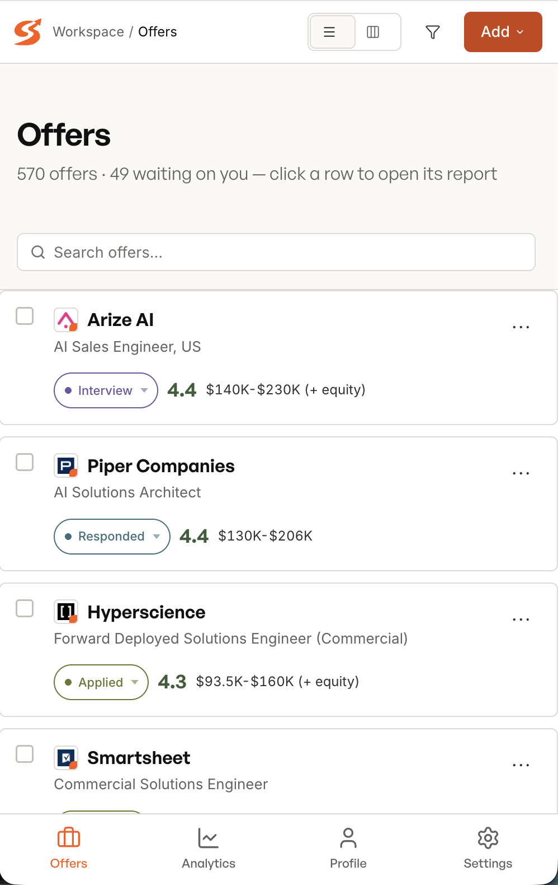

<a id="top"></a>

<div align="center">

<picture>
  <source media="(prefers-color-scheme: dark)" srcset="public/assets/sur9e-wordmark-white.svg">
  
</picture>

### Your AI job-hunt command center. Free, open-source, runs on your laptop.

<a href="LICENSE"><picture><source media="(prefers-color-scheme: dark)" srcset="https://img.shields.io/badge/License-MIT-f5f5f5.svg"></picture></a>
[](docs/setup.md)
[](CONTRIBUTING.md)

<picture><source media="(prefers-color-scheme: dark)" srcset="https://img.shields.io/badge/no_telemetry-f5f5f5.svg"></picture>


<sub>Runs in the AI coding CLI of your choice</sub>

<picture><source media="(prefers-color-scheme: dark)" srcset="https://img.shields.io/badge/Claude_Code-fff?style=flat&logo=anthropic&logoColor=000"></picture>
<picture><source media="(prefers-color-scheme: dark)" srcset="https://img.shields.io/badge/Codex-f5f5f5?style=flat"></picture>
<picture><source media="(prefers-color-scheme: dark)" srcset="https://img.shields.io/badge/OpenCode-fff?style=flat&logo=gnometerminal&logoColor=111827"></picture>

<sub>Built with</sub>

<picture><source media="(prefers-color-scheme: dark)" srcset="https://img.shields.io/badge/Next.js_16-fff?style=flat&logo=nextdotjs&logoColor=000"></picture>
<picture><source media="(prefers-color-scheme: dark)" srcset="https://img.shields.io/badge/React_19-fff?style=flat&logo=react&logoColor=087EA4"></picture>


<picture><source media="(prefers-color-scheme: dark)" srcset="https://img.shields.io/badge/Zustand-f5f5f5?style=flat"></picture>
<picture><source media="(prefers-color-scheme: dark)" srcset="https://img.shields.io/badge/Radix_UI-fff?style=flat&logo=radixui&logoColor=161618"></picture>
<picture><source media="(prefers-color-scheme: dark)" srcset="https://img.shields.io/badge/TipTap-f5f5f5?style=flat"></picture>


</div>

---

Sur9e turns an AI coding agent — **Claude Code, Codex, or OpenCode** — into a job-hunt copilot that actually knows you. If you already use one of those daily, you're minutes from your first evaluation; if you've never touched one, it's just an AI chat that runs on your computer, and sur9e walks you through setup itself. It evaluates job postings against your real CV, archetypes, dealbreakers, and comp targets; screens cheap before evaluating deep; tailors CVs per offer; preps you for interviews; and tracks every application in a local web UI.

**Who it's for:** anyone running a deliberate, quality-over-quantity job hunt — not a spray-and-pray autoclicker. You don't need to be a developer: if you can follow a short install guide and chat with an AI, sur9e works for you.

**The principles:**

- **Your data never leaves your machine.** CV, profile, evaluations — all files on disk in your clone. No accounts, no telemetry, no cloud. Actually true by architecture, not by promise.
- **Reasoning, not keyword matching.** Sur9e scores _fit_ against your career narrative, not keyword overlap with your resume.
- **Never auto-submits.** Every application is your call. AI gives velocity, not shortcuts.
- **No LLM markup.** You bring the AI subscription you already have; sur9e adds $0 on top.

<!-- screenshots:start -->
<div align="center">

<picture><source media="(prefers-color-scheme: dark)" srcset="public/gifs/quick-demo-dark.gif"></picture>

</div>
<!-- screenshots:end -->

## Quick start

**Prerequisites:** [Node.js](https://nodejs.org) 20+, [Python](https://www.python.org) 3.10+, and at least one AI coding CLI ([Claude Code](https://claude.com/claude-code) is the most polished path; [Codex](https://github.com/openai/codex) and [OpenCode](https://opencode.ai) also work).

One command checks your prerequisites, clones the repo, and launches the guided setup wizard:

```bash
bash -c "$(curl -fsSL https://sur9e.com/install)"
```

<details>
<summary><b>Prefer to run the steps yourself?</b></summary>

```bash
git clone https://github.com/arspesk/sur9e
cd sur9e
npm run setup        # guided wizard — deps, Playwright, Python venv, CLI + settings
cp .env.example .env # optional — only to override the default port (3000)
npm run doctor       # verifies everything is wired
```

</details>

Then start your AI agent inside the repo (e.g. run `claude`) — **the product onboards itself.** The agent detects the fresh install and walks you through CV intake, profile setup, positioning, and your first real evaluation. Details in [`docs/onboarding.md`](docs/onboarding.md).

Boot the web UI any time:

```bash
npm run web          # → http://localhost:3000 (use `npm run web:prod` for a production build)
```

## How it works

Sur9e is one project with **two interfaces sharing the same files on disk**:

1. **Your AI coding agent is the CLI.** There is no separate sur9e binary. The agent reads `CLAUDE.md` / `AGENTS.md`, loads mode prompts from `content/modes/`, and operates on the same markdown/JSON state the web app reads. Paste a job URL into the chat and the pipeline runs.
2. **A local web app is the cockpit.** Next.js 16 + React 19 at `localhost:3000`: offers table, kanban pipeline, an editable report viewer (Notion-style markdown editor), profile editing, per-mode model settings, and cost analytics. Light and dark themes included — it follows your system by default, or pick one in Settings.

The flow is a **two-stage pipeline**: new postings get a _cheap screen_ (fast model, fit/no-fit triage), and only survivors get the _deep evaluation_ (capable model — archetype fit scoring, comp analysis, legitimacy check, CV-match table). You get conviction where it matters and don't burn tokens where it doesn't.

### Modes

Each capability is a mode — a versioned prompt file in `content/modes/` with its own default model. Ask your agent in plain language; it routes to the right mode.

| You want to…                                  | Mode                                      | Runs as                         |
| --------------------------------------------- | ----------------------------------------- | ------------------------------- |
| Evaluate a job posting end-to-end             | `evaluate-offer` (screen → evaluate)      | paste a URL                     |
| Triage fast / score deeply                    | `screen` / `evaluate`                     | headless or UI Add menu         |
| Batch-process a queue of postings             | `batch-evaluate`                          | headless workers                |
| Scan job boards for new postings              | `scan`                                    | `npm run scan` or scheduled     |
| Generate a tailored CV PDF / cover letter     | `tailor-cv` / `cover-letter` / `latex`    | from any evaluated offer        |
| Strengthen your CV through a guided interview | `enrich`                                  | chat                            |
| Research a company / prep an interview        | `research` / `interview-prep`             | per-company artifacts           |
| Draft LinkedIn outreach / negotiate an offer  | `reach-out` / `negotiate`                 | chat                            |
| Compare offers / spot rejection patterns      | `offers` / `patterns`                     | chat                            |
| Track applications / follow-ups               | `tracker` / `process-queue` / `follow-up` | chat or web UI                  |
| Fill an application form (you hit Submit)     | `apply`                                   | live browser, stops before send |
| Evaluate a course or portfolio project        | `training` / `project`                    | chat                            |

Every mode reads your `inputs/personalization/` files at run time — your CV and narrative are the ground truth, never hardcoded into prompts. Each mode also has its own default model with a fallback chain, all editable in Settings.

### Reports you can edit

Every evaluation is a markdown file you own — and the web app ships a Notion-style editor on top of it. Edit the AI's reports inline, leave your own notes, restructure with slash commands, callouts, toggles, and highlights; everything saves straight back to the file on disk. The AI's take is the starting point, not the final word.

<div align="center">

<picture><source media="(prefers-color-scheme: dark)" srcset="public/gifs/markdown-editor-dark.gif"></picture>

</div>

### Job scanning (ATS portals + JobSpy)

`npm run scan` discovers new postings from two sources you toggle in **Settings → Job scanning → Sources**:

- **ATS portals** — a zero-token, pure-HTTP scan of company career feeds (Greenhouse, Ashby, Lever, Workday, Workable, Recruitee, SmartRecruiters, SolidJobs). You curate the company list in `inputs/personalization/portals.yml` (copy the example template to start). For any other careers page, point a [custom parser](docs/customization.md#custom-parsers-any-careers-page) script at it. No AI tokens, no browser.
- **Job board scraper (JobSpy)** — scans **public job board listings** (LinkedIn, Indeed, Google) via [JobSpy](https://github.com/cullenwatson/JobSpy) (Python, MIT) — no account required.

Both run on every scan and merge into the same pipeline. Either source can be turned off (keep at least one on). Everything runs on your machine.

Results from both are deduped against your history, sieved by your profile's search terms (one filter for both scanners), cheap-screened, and dropped into the pipeline. Scheduled scans can run on a cron window from Settings while the server is up.

### Pipeline analytics

The Analytics view shows how offers move through your pipeline — a conversion funnel from evaluated to applied, responded, interview, and offer, so you can see exactly where things stall.

### Cost transparency

Every run logs tokens and estimated USD (live OpenRouter pricing) per provider and model to `data/usage.json`, surfaced in the Analytics view. You always know what an evaluation cost.

Your interactive `/sur9e` turns are metered too — Claude Code, Codex, and OpenCode each ship an end-of-turn hook. See [Usage & cost tracking](docs/usage-tracking.md).

## Run it anywhere (Tailscale)

The web UI is fully responsive — table, board, report editor, and settings all work at desktop, tablet, and phone widths. Pair that with [Tailscale](https://tailscale.com) and your job hunt runs from any device you own:

<div align="center">

<picture><source media="(prefers-color-scheme: dark)" srcset="public/screenshots/mobile-dark.png"></picture>

</div>

```bash
npm run web:tailscale     # prod build, served over your tailnet (HTTPS)
npm run web:status        # who is on :3000, local + tailnet URLs
npm run web:stop          # stop the managed server
```

Tailscale mode uses `tailscale serve`: the app gets an HTTPS URL like `https://<machine>.<tailnet>.ts.net`, reachable **only inside your tailnet** — never the public internet. Requires the Tailscale app installed and logged in (free for personal use).

> ⚠️ **Sur9e has no login.** Anyone on your tailnet gets full access — including running jobs that spend your AI credits and reading your CV, profile, and tracker. Keep your tailnet personal.

## Tech stack

Next.js 16 (App Router, Turbopack) · React 19 · TanStack Query · Zustand · Radix primitives · TipTap editor · react-hook-form + zod · Biome + Prettier · vitest + Playwright · Python ([JobSpy](https://github.com/cullenwatson/JobSpy)) for scanning · your AI coding CLI as the model runtime.

Built standing on two projects that are both stack and inspiration:

- **[career-ops](https://github.com/santifer/career-ops)** by Santiago Fernández de Valderrama — the project that proved AI job-hunt tooling could work as a CLI workflow. Sur9e takes that core idea further with multi-provider support, a web UI, and a two-stage screening pipeline.
- **[JobSpy](https://github.com/cullenwatson/JobSpy)** by Cullen Watson — the MIT-licensed scraper that powers Sur9e's LinkedIn scanning.

## Project structure

```
src/app/                  — Next.js App Router (routes + RSC pages + /api/* JSON compat)
src/features/<feature>/   — Feature-folder UI (profile, report, table, pipeline, analytics, settings)
src/components/           — primitives / domain / modals / shell (Radix-backed)
src/server/actions/       — Server Actions (all mutations)
src/lib/server/           — Node-only loaders / writers / schemas (the business logic)
src/hooks/ · src/stores/  — TanStack Query wrappers · Zustand UI state
src/app/styles/           — Global CSS (tokens.css = design-token source of truth)
content/modes/            — Agent mode prompts (one per capability)
content/examples/         — Personalization templates to copy from
cli/                      — Node CLI tools (doctor, verify-pipeline, generate-pdf, …)
scripts/                  — Web launcher, setup migrations
batch/                    — Headless workers: ATS portal + JobSpy scanning + screen/evaluate runners
inputs/personalization/   — Your CV / profile / narrative (gitignored)
data/ · artifacts/        — Runtime state · generated reports/PDFs (gitignored)
test/                     — vitest unit tests + Playwright e2e
```

Architecture deep-dive: [`docs/architecture.md`](docs/architecture.md) · setup: [`docs/setup.md`](docs/setup.md) · personalization: [`docs/customization.md`](docs/customization.md) · data boundaries: [`docs/data-contract.md`](docs/data-contract.md).

## Development

```bash
npm run dev        # dev server (Turbopack) on http://localhost:3000
npm run build      # production build
npm run start      # serve the production build on http://localhost:3000
npm run lint       # Biome + Prettier
npm run typecheck  # tsc
npm run test:unit  # vitest
npm run test:e2e   # Playwright
npm run test:quick # full gate — runs on every commit via .githooks/pre-commit
```

Contributions welcome — human-written or AI-assisted. Read [`CONTRIBUTING.md`](CONTRIBUTING.md) first; [`CLAUDE.md`](CLAUDE.md) / [`AGENTS.md`](AGENTS.md) are the operating manual your agent should load.

## Roadmap

- **More scanning sources** — additional ATS APIs and job-platform APIs
- **Leads space** — dedicated tracking for contacts and referrals, not just applications
- **More coding-agent CLIs** — Antigravity (`agy`) is next, then others beyond the current three providers
- **Bring-your-own API keys** — run modes against raw LLM APIs, no coding-agent subscription required
- **Packaged app** — one-step install, no `git clone` needed
- **In-app AI assistant** — chat with your pipeline directly inside the web UI

Have an idea? The roadmap is community-driven — [open an issue](https://github.com/arspesk/sur9e/issues).

## Disclaimer

Sur9e is a local tool that connects to the AI provider **you** choose; evaluation scores are AI-generated opinions, not career advice, and you must review every generated document before sending it to an employer. Scanning covers **public job listings**, runs on your machine, and requires no LinkedIn account — you are responsible for complying with the terms of every platform you interact with. Sur9e never auto-submits applications and rejects contributions that would make it do so. Full terms: [`LEGAL_DISCLAIMER.md`](LEGAL_DISCLAIMER.md).

## License

Code is licensed under the [MIT License](LICENSE) — including the upstream copyright of Santiago Fernández de Valderrama (career-ops).

The **Sur9e name and logo are not covered by the MIT license.** They may not be used to name forks, imply endorsement, or suggest official affiliation — see [`TRADEMARK.md`](TRADEMARK.md).

## About the author

Sur9e is built and maintained by **Arsenii Peskovatskov** ([arspesk](https://github.com/arspesk)) — I built it for my own job hunt and made it free and open so yours goes better too. Bug reports, feature ideas, and PRs are all welcome (start with [an issue](https://github.com/arspesk/sur9e/issues)); for anything else, reach out directly at **[hello@sur9e.com](mailto:hello@sur9e.com)**.

<a href="https://www.linkedin.com/in/arsenii-peskovatskov-757991217/"></a>
<a href="mailto:hello@sur9e.com"></a>

---

<div align="center">

<sub><a href="#top">↑ back to top</a></sub>

<picture>
  <source media="(prefers-color-scheme: dark)" srcset="public/assets/sur9e-wordmark-white.svg">
  
</picture>

<sub>MIT licensed · Arsenii Peskovatskov · <a href="https://github.com/arspesk">@arspesk</a></sub>

</div>
